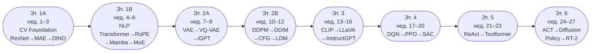

<alphaxiv-thinking-title title="Верифицируем все неподтверждённые статьи" />

<alphaxiv-thinking-title title="Верифицируем Mamba, MobileNetV2, QLoRA, TinyLlama, SAC, RoPE" />

<alphaxiv-thinking-title title="Ищем оставшиеся дополнительные статьи" />

<alphaxiv-thinking-title title="Собираем финальный полный план" />

Все статьи верифицированы. Теперь собираю единый, исчерпывающий план.

---

# 🗺️ Мастер-план репликаций: Efficient Deep Learning от фундамента до роботов

> **Легенда сложности:** ⭐ просто → ⭐⭐⭐⭐⭐ очень сложно
> **4GB метки:** 🟢 влезает легко · 🟡 нужны трюки · 🔴 только с агрессивными оптимизациями

---

## 🧰 Постоянный Efficiency-стек (используй везде с Этапа 1)

Реализуй эти блоки **один раз** и подключай ко всем последующим экспериментам как миксины:

| Блок | Статья | Что даёт |
|---|---|---|
| Gradient Checkpointing | [Training Deep Nets with Sublinear Memory Cost](https://arxiv.org/abs/1604.06174) | $O(\sqrt{n})$ памяти вместо $O(n)$ на активациях. Цена — +30% compute. |
| 8-bit Optimizer | [8-bit Optimizers via Block-wise Quantization](https://arxiv.org/abs/2110.02861) | Adam хранит 3× веса модели. Этот метод режет расход оптимайзера в 4 раза. |
| LoRA | [LoRA: Low-Rank Adaptation of Large Language Models](https://arxiv.org/abs/2106.09685) | Обучаешь 0.1–1% параметров, остальное заморожено. |
| QLoRA | [QLoRA: Efficient Finetuning of Quantized LLMs](https://arxiv.org/abs/2305.14314) | LoRA + 4-bit quantization. Запускает 7B-модели на 4GB VRAM. |
| FlashAttention-2 | [FlashAttention-2: Faster Attention with Better Parallelism](https://arxiv.org/abs/2307.08691) | Tiled attention — экономит память и ускоряет обучение на Ampere+. |

---

## 🏛️ Этап 1 — Классический фундамент CV + NLP
**Срок: ~6 недель**

### 1.1 Computer Vision Backbone

| Статья | Ключевой блок для репо | Сложность | VRAM |
|---|---|---|---|
| [Deep Residual Learning (ResNet)](https://arxiv.org/abs/1512.03385) | `residual_block.py`, `bottleneck_block.py` | ⭐⭐ | 🟢 |
| [MobileNetV2: Inverted Residuals](https://arxiv.org/abs/1801.04381) | `depthwise_sep_conv.py`, `inverted_residual.py` | ⭐⭐ | 🟢 |
| [ViT: An Image is Worth 16×16 Words](https://arxiv.org/abs/2010.11929) | `patch_embed.py`, `vit_encoder.py`, `class_token.py` | ⭐⭐ | 🟡 |
| [DINO: Self-Supervised Vision Transformers](https://arxiv.org/abs/2104.14294) | `dino_head.py`, `student_teacher_update.py` | ⭐⭐⭐ | 🟡 |
| [MAE: Masked Autoencoders](https://arxiv.org/abs/2111.06377) | `masking_strategy.py`, `asymmetric_enc_dec.py` | ⭐⭐⭐ | 🟡 |

> **Порядок:** ResNet → MobileNetV2 → ViT → MAE → DINO. Каждая следующая зависит от предыдущей.
> **4GB трюк:** ViT-Tiny ($d=192, h=3, layers=12$) на CIFAR-10 c `fp16` + Gradient Checkpointing.

---

### 1.2 NLP / Transformer

| Статья | Ключевой блок для репо | Сложность | VRAM |
|---|---|---|---|
| [Attention Is All You Need](https://arxiv.org/abs/1706.03762) | `mha.py`, `positional_encoding.py`, `encoder_decoder.py` | ⭐⭐ | 🟢 |
| [RoFormer: Rotary Position Embedding (RoPE)](https://arxiv.org/abs/2104.09864) | `rope.py` | ⭐⭐ | 🟢 |
| [Linformer: Self-Attention with Linear Complexity](https://arxiv.org/abs/2006.04768) | `linformer_attn.py` | ⭐⭐ | 🟢 |
| [Synthesizer: Rethinking Self-Attention](https://arxiv.org/abs/2005.00743) | `synthetic_attn.py` | ⭐⭐ | 🟢 |
| [HybridNorm: Stable Transformer Training](https://arxiv.org/abs/2503.04598) | `norm_variants.py` (Pre/Post/Hybrid) | ⭐⭐ | 🟢 |
| [TinyLlama: Open-Source Small LM](https://arxiv.org/abs/2401.02385) | Рецепт сборки LLM на малых ресурсах (RoPE + RMSNorm + GQA) | ⭐⭐⭐ | 🟡 |

> **4GB трюк:** `d_model=128–256`, seq_len≤512. RoPE обязательно реализуй сразу — он используется во всех современных LLM (LLaMA, Mistral, Mamba).

---

### 1.3 Efficient Sequence Modeling

| Статья | Ключевой блок для репо | Сложность | VRAM |
|---|---|---|---|
| [Mamba: Linear-Time Sequence Modeling](https://arxiv.org/abs/2312.00752) | `ssm_layer.py`, `selective_scan.py` | ⭐⭐⭐ | 🟢 |

> Mamba — это твоя дешёвая замена Attention на длинных последовательностях. После реализации можно подключать как drop-in в любую seq2seq архитектуру.

---

### 1.4 Mixture of Experts (MoE)

| Статья | Ключевой блок для репо | Сложность | VRAM |
|---|---|---|---|
| [Sparsely-Gated MoE (Shazeer 2017)](https://arxiv.org/abs/1701.06538) | `moe_layer.py`, `router.py` | ⭐⭐⭐ | 🟡 |
| [Switch Transformers](https://arxiv.org/abs/2101.03961) | `top1_router.py`, `load_balance_loss.py` | ⭐⭐⭐ | 🟡 |
| [Mixtral of Experts](https://arxiv.org/abs/2401.04088) | `top2_router.py`, `expert_ffn_bank.py` | ⭐⭐⭐⭐ | 🔴 |

> **4GB трюк:** Реализуй MoE с 2–4 экспертами и $d_{model}=128$ как замену FFN в маленьком трансформере. Акцент на auxiliary load-balance loss — без него routing коллапсирует.

---

## 🎨 Этап 2 — Генеративные модели
**Срок: ~6 недель**

### 2.1 VAE-семейство

| Статья | Ключевой блок для репо | Сложность | VRAM |
|---|---|---|---|
| [VAE: Auto-Encoding Variational Bayes](https://arxiv.org/abs/1312.6114) | `vae_encoder.py`, `reparameterization.py`, `elbo_loss.py` | ⭐⭐ | 🟢 |
| [VQ-VAE: Neural Discrete Representation Learning](https://arxiv.org/abs/1711.00937) | `vq_layer.py`, `codebook.py`, `straight_through_estimator.py` | ⭐⭐⭐ | 🟢 |
| [VQ-VAE-2](https://arxiv.org/abs/1906.00446) | `hierarchical_vq.py` (top + bottom latents) | ⭐⭐⭐ | 🟡 |

> **Порядок важен:** VAE → VQ-VAE → VQ-VAE-2. Латентные коды VQ-VAE-2 ты будешь использовать как "холст" для авторегрессии и диффузии дальше.
> **4GB трюк:** Ограничись латентным пространством $16 \times 16$ и одним уровнем иерархии у VQ-VAE-2.

---

### 2.2 Авторегрессивная генерация изображений

| Статья | Ключевой блок для репо | Сложность | VRAM |
|---|---|---|---|
| [iGPT: Generative Pretraining from Pixels](https://cdn.openai.com/papers/Generative_Pretraining_from_Pixels_V2.pdf) | `pixel_tokenizer.py`, `autoregressive_image_gpt.py` | ⭐⭐⭐ | 🟡 |

> iGPT — это GPT из Этапа 1, применённый к изображениям. Вместо пикселей возьми дискретные коды твоего VQ-VAE — это уже почти DALL-E.

---

### 2.3 Диффузия

| Статья | Ключевой блок для репо | Сложность | VRAM |
|---|---|---|---|
| [DDPM](https://arxiv.org/abs/2006.11239) | `noise_scheduler.py`, `unet_denoiser.py` | ⭐⭐⭐ | 🟡 |
| [Improved DDPM](https://arxiv.org/abs/2102.09672) | `cosine_schedule.py`, `learned_variance.py` | ⭐⭐⭐ | 🟡 |
| [DDIM](https://arxiv.org/abs/2010.02502) | `ddim_sampler.py` | ⭐⭐⭐ | 🟢 |
| [Classifier-Free Guidance (CFG)](https://arxiv.org/abs/2207.12598) | `cfg.py`, `null_conditioning.py` | ⭐⭐⭐ | 🟡 |
| [Latent Diffusion Models (Stable Diffusion)](https://arxiv.org/abs/2112.10752) | `latent_diffusion.py`, `cross_attention_conditioning.py` | ⭐⭐⭐⭐ | 🔴 |

> **Порядок:** DDPM → Improved DDPM → DDIM → CFG → LDM.
> **4GB трюк:** Запускай диффузию **внутри** латентного пространства своего VQ-VAE (разрешение $16 \times 16$). LDM с нуля не реплицируй — изучи архитектуру через код CompVis и fine-tune через LoRA.

---

## 🔗 Этап 3 — Мультимодальность и Alignment
**Срок: ~4 недели**

| Статья | Ключевой блок для репо | Сложность | VRAM |
|---|---|---|---|
| [CLIP: Learning Transferable Visual Models](https://arxiv.org/abs/2103.00020) | `contrastive_loss.py` (InfoNCE), `dual_encoder.py` | ⭐⭐ | 🟡 |
| [LLaVA: Visual Instruction Tuning](https://arxiv.org/abs/2304.08485) | `vision_projector.py`, `multimodal_instruction_tuning.py` | ⭐⭐⭐ | 🔴 |
| [InstructGPT (RLHF)](https://arxiv.org/abs/2203.02155) | `reward_model.py`, `ppo_rlhf_pipeline.py` | ⭐⭐⭐⭐ | 🔴 |

> **4GB трюк для LLaVA:** Заморозь CLIP-ViT и LLaMA-3.2-1B (через QLoRA). Обучай только Linear Projection Layer — это буквально несколько тысяч параметров.
> **4GB трюк для RLHF:** Используй GPT-2 Small (124M) как policy. RLHF на нём — это учебный проект, но pipeline (SFT → RM → PPO) ты поймёшь полностью.

---

## 🎮 Этап 4 — Reinforcement Learning
**Срок: ~4 недели**

| Статья | Ключевой блок для репо | Сложность | VRAM |
|---|---|---|---|
| [DQN: Playing Atari with Deep RL](https://arxiv.org/abs/1312.5602) | `replay_buffer.py`, `target_network.py`, `q_network.py` | ⭐⭐ | 🟢 |
| [PPO: Proximal Policy Optimization](https://arxiv.org/abs/1707.06347) | `ppo_clipped.py`, `gae.py`, `actor_critic.py` | ⭐⭐⭐ | 🟢 |
| [SAC: Soft Actor-Critic](https://arxiv.org/abs/1801.01290) | `sac.py`, `entropy_regularization.py`, `twin_critics.py` | ⭐⭐⭐ | 🟢 |

> **Порядок:** DQN → PPO → SAC. SAC — лучший off-policy алгоритм для непрерывного управления (роботы) и более стабильный чем PPO в MuJoCo-задачах.
> **4GB трюк:** CartPole, LunarLander, MuJoCo HalfCheetah — не требуют GPU вообще (CPU достаточно). GPU нужен только когда state = изображение.

---

## 🤖 Этап 5 — Агенты и Инструменты
**Срок: ~3 недели**

| Статья | Ключевой блок для репо | Сложность | VRAM |
|---|---|---|---|
| [ReAct: Reasoning + Acting in LLMs](https://arxiv.org/abs/2210.03629) | `react_loop.py`, `tool_executor.py` | ⭐⭐ | 🔴 |
| [Toolformer](https://arxiv.org/abs/2302.04761) | `tool_call_generator.py`, `api_wrapper.py` | ⭐⭐⭐ | 🔴 |

> **4GB трюк:** ReAct запускай поверх квантованной Llama-3.2-1B (через `bitsandbytes` + `transformers`). Toolformer — реплицируй логику генерации tool-augmented данных, само обучение можно пропустить или использовать GPT-2.

---

## 🦾 Этап 6 — Робототехника (Embodied AI)
**Срок: ~4 недели**

| Статья | Ключевой блок для репо | Сложность | VRAM |
|---|---|---|---|
| [ACT: Action Chunking with Transformers](https://arxiv.org/abs/2304.13705) | `cvae_policy.py`, `temporal_ensembling.py` | ⭐⭐⭐ | 🟡 |
| [Diffusion Policy](https://arxiv.org/abs/2303.04137) | `diffusion_policy.py` (переиспользуй `ddpm`), `action_denoiser.py` | ⭐⭐⭐⭐ | 🟡 |
| [RT-2: Vision-Language-Action Models](https://arxiv.org/abs/2307.15818) | `action_tokenizer.py`, `vla_pipeline.py` | ⭐⭐⭐⭐⭐ | 🔴 |

> **Порядок:** ACT → Diffusion Policy → RT-2.
> **4GB трюк:** Обучай на **Push-T** (2D симулятор с публичным кодом) или **ALOHA sim**. В Diffusion Policy замени тяжёлый UNet на маленький MLP-денойзер из своего Этапа 2. RT-2 реплицируй в духе статьи: PaliGemma-3B (через QLoRA) + токенизация действий как текст.

---

## 🗓️ Общая временная шкала



---

## 📂 Финальная структура репозитория

```
efficient-dl-replications/
├── blocks/
│   ├── attention/          # mha.py, linformer_attn.py, synthetic_attn.py, rope.py
│   ├── norm/               # norm_variants.py (Pre/Post/Hybrid LayerNorm, RMSNorm)
│   ├── conv/               # residual.py, depthwise_sep_conv.py, inverted_residual.py
│   ├── ssm/                # ssm_layer.py, selective_scan.py
│   ├── moe/                # router.py, expert_ffn_bank.py, load_balance_loss.py
│   ├── generative/         # vq_layer.py, noise_scheduler.py, ddim_sampler.py, cfg.py
│   ├── rl/                 # replay_buffer.py, ppo_clipped.py, gae.py, sac.py
│   └── robotics/           # cvae_policy.py, action_tokenizer.py, diffusion_policy.py
├── efficiency/
│   ├── checkpointing.py    # Gradient Checkpointing wrapper
│   ├── quantization.py     # QLoRA / 8-bit utils
│   ├── lora.py             # LoRA / QLoRA layers
│   └── flash_attn.py       # FlashAttention-2 integration
├── experiments/            # Папка с train-скриптами для каждой статьи
└── README.md               # Твой "Low-VRAM AI Implementation Guide"
```

---

## ⚠️ Три честных предупреждения

- **LDM и RT-2 — самые переоценённые цели.** Полная репликация нереалистична на 4GB. Твой настоящий результат — понять архитектуру и запустить mini-версию. Это важнее, чем выбить SOTA.
- **MoE требует аккуратной реализации auxiliary loss.** Без него routing collapse происходит незаметно: лосс падает, модель "учится", но большинство экспертов мертвы.
- **Порядок этапов — не декорация.** VQ-VAE → iGPT → LDM — это осознанная цепочка: ты переиспользуешь свои же блоки, а не пишешь каждый раз с нуля. Именно это превращает репо из "коллекции скриптов" в "библиотеку".